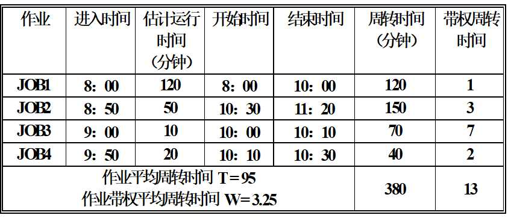
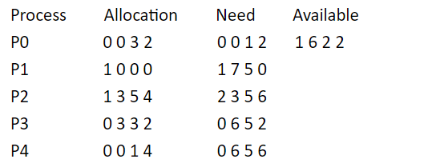
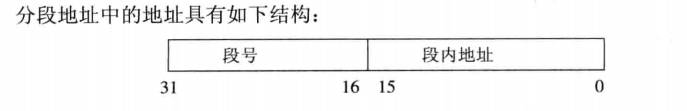

# 操作系统期末复习

## 第一章 操作系统引论

### 1. 什么是操作系统

&emsp;操作系统为用户完成所有"硬件相关、应用无关"的工作，以给用户方便、高效、安全的使用环境。

#### 1.1 定义

&emsp;操作系统是一个大型的程序系统，它负责计算机的全部软、硬件资源的分配、调度工作，控制并协调多个任务的活动，实现信息的存取和保护。它提供用户接口，使用户获得良好的工作环境。

#### 1.2 目标

- 方便性：配置 OS 后计算机系统更容易使用；
- 有效性：改善资源利用率；提高系统吞吐量；
- 可扩充性：OS 的结构（无结构发展 -> 模块化结构 -> 层次化结构 -> 微内核结构）
- 开放性：OS 遵循世界标准范围。

#### 1.3 作用

- OS 作为用户与计算机硬件系统之间的接口。**OS 处于用户与计算机硬件系统之间，用户通过 OS 来使用计算机系统**。
- OS 是计算机系统资源的管理者。
  - 处理机管理是用于分配和控制处理机；
  - 存储器管理是负责内存的分配与回收；
  - IO 设备管理是负责 IO 设备的分配与操作；
  - 文件管理是用于实现文件的存取、共享和保护；
- OS 实现了对计算机资源的抽象

### 2. 操作系统的发展过程

#### 2.1 手工操作阶段

&emsp;人工操作方式：用户独占全机，资源空闲浪费。

- 手工装卸、人工判断、手工修改与调试内存指令等造成 CPU 空闲；
- 提前完成造成剩余预约时间内的 CPU 完全空闲；
- IO 设备的慢速与 CPU 的速度不匹配造成的 CPU 空闲等待时机；

#### 2.2 单道批处理系统

&emsp;单道批处理系统是在解决人机矛盾和 CPU 与 IO 设备速度不匹配矛盾的过程中形成的。批处理系统旨在提高系统资源的利用率和系统的吞吐量。

&emsp;缺点：**系统资源利用率低**

&emsp;特征：

- 自动性：一批作业自动依次运行，无需人工干预；
- 顺序性：各道作业是顺序进入内存；
- 单道性：内存中任意时刻只有一道作业；

#### 2.3 多道批处理系统

&emsp;为了进一步提高资源利用率和系统吞吐量。在该系统中，用户提交的作业都先存在外存中，在作业 A 在执行 IO 请求时，CPU 空闲，此时调度作业 B，防止 CPU 空闲。同理按一定的算法调用作业，防止 CPU 空闲。

> 推动多道批处理系统形成和发展的动力是提高资源利用率和系统吞吐量。

&emsp;优点：

- 资源利用率高；
- 系统吞吐量大；

&emsp;缺点：

- 平均周转时间长；
- 无交互能力；

&emsp;特点：

- 多道：内存同时存在多个作业；
- 宏观上并行：同时有多道程序在内存中运行；
- 微观上串行：任意时刻最多只有一道作业占用 CPU，多道程序交替使用 CPU

#### 2.4 分时系统

&emsp;分时系统是指在一台主机上连接多个带有显示器和键盘的终端，同时允许多个用户通过自己的键盘，以交互的方式使用计算机，共享主机中的资源。

&emsp;特征：

- 多路性：允许同一主机联接多台终端；
- 独立性：每一用户独占一个终端；每个用户感觉不到其它用户的存在；
- 及时性：用户请求能及时响应；
- 交互性：可进行广泛的人机对话

#### 2.5 实时操作系统

&emsp;实时操作系统是指系统能及时响应外部事件的请求，在规定的时间内完成对该事件的处理，并控制所有实时任务协调一致地运行。

&emsp;特征：

- 多路性：对实时处理系统，系统按分时原则为多个终端服务；对实时控制系统，系统经常对多路现场信息进行采集；以及对多个对象或多个执行机构进行控制；
- 独立性：实时处理下系统，每个终端用户向实时系统提出服务请求时，彼此独立；实时控制系统对信息的采集和对对象的控制彼此不干扰；
- 及时性：开始截止时间/完成截止时间；
- 交互性：仅限于访问专用服务程序；
- 可靠性：多级容错措施保障系统和数据安全；

#### 2.6 微机操作系统

#### 2.7 多处理机操作系统

#### 2.8 网络操作系统

#### 2.9 分布式操作系统

#### 2.10 嵌入式操作系统

### 3. 操作系统的基本特征

#### 3.1 并发

&emsp;并发是指在内存中放多道作业，在一个时间段上看，每一道作业能不同程度地向前推进。但在任何一个时间点上只能有一道占用 CPU。

- 串行：在内存中每次只能放一道作业，只有它完全执行完后别的作业才能进入内存执行；
- 并行：存在于有多个 CPU 的环境中，在内存中放多道作业，在任意时间点上都可能有多道作业在不同的 CPU 上同时执行；

#### 3.2 共享

&emsp;系统中的资源可供多个并发的进程共同使用。根据资源属性的不同，有两种资源共享方式：**互斥共享方式**和**同时访问方式**。

#### 3.3 虚拟

&emsp;通过某种技术将一个物理实体映射为若干个逻辑上对应物，或将多个物理实体映射为一个逻辑实体。

&emsp;虚拟是操作系统管理系统资源的重要手段，可提高资源利用率。

#### 3.4 异步

&emsp;不确定性：什么时候开始，执行多久时间，终止时间。

### 4.操作系统的主要功能

- **处理机管理功能**：进程控制、进程同步、进程通信、调度；
- **存储器管理功能**：内存分配、内存保护、存储扩充、地址映射；
- **设备管理功能**：缓冲管理、设备分配、设备处理；
- **文件管理功能**：文件存储空间的管理、目录管理、文件的读/写管理和保护；
- 操作系统与用户之间的接口：命令接口、程序接口、图形接口；
- 现代 OS 的新功能：系统安全、支持多媒体、网络通信等。

### 5. 操作系统的结构设计

&emsp;传统 OS 结构:无结构 OS、模块化 OS、分层式 OS；
&emsp;现代 OS 结构：微内核结构；

## 第二章 进程的描述与控制

### 1. 进程的定义和特征

&emsp;进程有各式各样的定义：

- 行为的一个规则叫做程序，程序在处理机上执行时所发生的活动称为进程。
- 具有一定功能的程序在某个数据集合上的一次活动。
- 进程是一个程序与其数据一道通过处理机的执行所发生的活动。
- 进程是指进程实体的运行过程，是系统进行资源分配和调度的独立单位。
- 程序的执行过程，从开始到 结束

&emsp;进程的特征：

- 结构性：由程序、数据、控制块三部分组成；
- 动态性：进程是程序的执行过程；
- 并发性：多个进程可同存于内存中，能在一段时间内同时运行；
- 独立性：独立运行的基本单位，独立获得资源和调度的基本单位；
- 异步性：各进程按各自独立的不可预知的速度向前推进；

### 2. 进程与程序的区别：

- 程序是指令的有序集合，与其本身没有任何运行含义，是一个静态概念。
- 进程是程序在处理机上的一次执行过程，它是一个动态的概念。
- 进程更能真实地描述并发，而程序不能；
- 进程是由程序、数据和进程控制块三部分组成的；
- 同一程序同时运行于若干数据集合上，它将属于若干个不同的进程。也就是说，一个程序可以对应多个进程。

### 3. 进程的 3 种状态及转换

- 就绪状态（R 态）：**存在于处理机调度队列中的所有进程，它们已经准备就绪，一旦得到 CPU，就立即可以运行**。
- 运行状态（E 态）：正在运行的进程所处的状态为运行状态。
- 等待/阻塞/睡眠状态（B 态）：若一个进程正在等待某一事件发生，这时即使给它 CPU，它也无法运行，该进程状态就处于等待状态。


&emsp;状态进程模型：


### 4. 进程控制块 PCB

&emsp;PCB 是 OS 中最重要的记录型数据结构：

- PCB 是 OS 感知进程存在的唯一标志；
- 进程与 PCB 是一一对应的；
- PCB 随进程创建而建立，随进程结束而回收；
- PCB 应常驻内存；

> PCB 的作用是：**将一个不能独立运行的程序变成一个可以独立运行的基本单位，一个能与其它进程并发执行的进程**。

&emsp;进程描述信息：

- 进程标识符：唯一，通常是一个整数；
- 进程名：基于可执行文件名；
- 用户标识符：进程组关系；

### 5. 进程同步

#### 5.1 制约关系

- 间接相互制约关系：系统资源竞争，进程间彼此无关；
- 直接相互制约关系：进程间合作，彼此相关；

#### 5.2 临界资源

&emsp;一次仅允许一个进程访问的资源。

#### 5.3 临界区

&emsp;临界段，在每个程序中，访问临界资源的那段程序。

> &emsp;程序段 A、B 有关于变量 X 的临界区，而 C、D 有关于变量 Y 的临界区，那么 A、B 之间需要互斥执行，C、D 之间也需要互斥执行，但 A 与 C、B 与 D 之间不需要互斥执行。
> **&emsp;临界区是对某一临界资源而言的，对于不同临界资源的临界区，它们之间不存在互斥。**

#### 5.4 同步机制应遵循的规则

- 空闲让进；
- 忙则等待；
- 有限等待；
- 让权等待；

#### 5.5 信号量机制

- 整型信号量：定义一个整型量，由两个标准原子操作 wait(S)(即：P 操作)和 signal(S)(即：V 操作)来访问。两个操作均为原语操作。

##### 例题

---

&emsp;**1、桌上有一空盘，最多允许存放一只水果。爸爸可向盘中放一个苹果或放一个桔子，儿子专等吃盘中的桔子，女儿专等吃苹果。试用 P、V 操作实现爸爸、儿子、女儿三个并发进程的同步。**

> 设置三个信号量：S,So,Sa。
>
> - S: 表示可否向盘中放水果，初始值为 1，表示能放水果；
> - So:表示可否取橘子，初始值为 0；
> - Sa: 表示可否取苹果，初始值为 0;

```
Father(){
  while(1){
    P(S);
    // 将水果放入盘中
    if(是橘子){
      V(So);
    }else{
      V(Sa);
    }
  }
}

Son(){
  while(1){
    P(So);
    // 取橘子
    V(S);
    // 吃橘子
  }
}

Daughter() {
  while(1){
    P(Sa);
    // 取苹果
    V(S);
    // 吃苹果
  }
}
```

---

&emsp;**2.有一个仓库，可以存放 A 和 B 两种产品。存储空间充分大，但要求：（1） 每次只能存入一种产品（A 或 B）（2） －N ＜ A 产品数量－B 产品数量＜ M。其中，N 和 M 是正整数。试用 P、V 操作描述产品 A 与 B 的入库过程。**

> 设置互斥信号量：mutex，初始值为 1
> Sa: 表示允许 A 产品比 B 产品多入库的数量，初值为 M-1;即 B 的数量为 0，A 最多为 M-1；
> Sb: 表示允许 B 产品比 A 产品多入库的数量，初始值为 N-1;即 A 的数量为 0,B 最多为 N-1

```
// A产品入库进程
while(1){
  // 生产A产品
  P(Sa);
  P(mutex);
  // A入库
  V(mutex);
  V(sb);
}

// B产品入库进程
while(1){
  // 生产B产品
  P(Sb);
  p(mutex);
  // B入库
  V(mutex);
  V(Sa);
}
```

&emsp;**3、问题描述：假定阅览室最多容纳 100 人阅读，读者进入时，必须在门口的登记表上登记，内容包括：姓名、座号等；离开时要撤销登记内容。用 P、V 操作描述读者进程的同步算法。**

```
define CHAIR 100 // 定义椅子数量
define mutex=1 // 互斥量 可视为锁
define readers=0 // 当前阅览室读者数量

// 读者进程
void readeri(i=1,2,3,...){
  P(mutex); // 获取锁
  if(readers < CHAIR){

    // 读者登记操作
    readers++; // 读者数量+1
    V(mutex); // 释放锁
    // 阅读

    P(mutex); //获取锁，准备离开了
    // 撤销登记
    readers--;
    V(mutex); // 释放锁

  }else{
    V(mutex); // 没椅子就直接释放锁
  }
}

```

&emsp;**4、问题描述：理发店由一个有几张凳子的等待室和一个放有一张理发椅的理发室组成。若没有理发的人员，理发师睡觉；若顾客到来，且所有的椅子占满，则该顾客离开理发店；若理发师正在理发，则该顾客就找一张椅子坐下等待；若理发师在睡觉，则该顾客唤醒理发师。设计一个理发师和顾客的协调程序。**

```
define CHAIR N // 理发店有N把椅子
define mutex=1 // 互斥锁，用于保护对临界资源的访问
define barber_ready=0 // 用于表示理发师是否准备好理发，因为刚开始理发师在睡觉
define customer_ready=0 // 用于表示顾客是否准备好理发
define waiting=0 // 等待的顾客数量

// 理发师进程
void barber(){
  while(1){
    P(customer_ready); // 等待顾客前来理发
    P(mutex); // 获取锁
    waiting--;
    V(barber_ready); // 通知理发师进行理发
    V(mutex);  // 释放锁
    // 理发
  }
}

// 顾客进程
void customer(){
  P(mutex);// 获取锁
  if(waiting < N){
    waiting++; // 等待顾客+1
    V(customer_reader); // 通知有顾客前来理发
    V(mutex); // 释放锁
    P(barber_ready); // 等待理发师
    // 理发

  }else{
    V(mutex);//释放锁
    // 离开
  }
}

```

### 6. 进程通信

| 方式     | 传输的信息量       | 使用场景       | 关键词                                                                 |
| -------- | ------------------ | -------------- | ---------------------------------------------------------------------- |
| 信号     | 少量               | 任何           | 硬件来源、软件来源 / 信号队列                                          |
| 管道     | 大量               | 亲缘进程间     | 单向流动 / 内核缓冲区 / 循环队列 / 没有格式的字节流 / 操作系统负责同步 |
| 命名管道 | 大量               | 任何           | 磁盘文件 / 访问权限 / 无数据块 / 内核缓冲区 / 操作系统负责同步         |
| 信号量   | N                  | 任何           | 互斥同步 / 原子性 / P 减 V 增                                          |
| 共享内存 | 大量               | 多个进程       | 内存映射 / 简单快速 / 操作系统不保证同步                               |
| 消息队列 | 比信号多，但有限制 | 任何           | 有格式 / 按消息类型过滤 / 操作系统负责同步                             |
| 套接字   | 大量               | 不同主机的进程 | 读缓存区 / 写缓冲区 / 操作系统负责同步                                 |

### 7. 线程

&emsp;线程是**进程中的一个实体，是被系统独立调度的基本单位**。

#### 7.1 线程的引入

- 引入进程的目的：多个程序更好地并发执行，改善资源利用率、提高系统效率；
- 引入线程的目的：减少并发执行时所付出的时空开销，使并发细粒度更细、并发性更好。

#### 7.2 进程的两个基本属性

- 进程是一个资源分配的基本单位；
- 进程是一个可独立调度和分派的基本单位；

#### 7.3 引入线程的好处

- 创建一个新线程花费时间少；
- 线程的终止时间比进程短；
- 同进程内的线程切换时间比进程短；
- 同一进程内的线程之间相互可以通信而无需调用内核；

## 第三章 处理机调度与死锁

### 1. 处理机调度的三个层次

- 高级调度：决定外存上处于后备队列中的哪些作业调入内存，并为它们创建进程、分配必要的资源，再将新创建的进程排在就绪队列上，准备执行。
- 中级调度：涉及进程在内、外存间的交换，从存储器资源管理的角度来看，把进程的部分或全部换出到外存上，可为当前运行进程的执行提供所需内存空间。
- 低级调度：用来决定就绪队列中哪个进程应获得处理机，再由分派程序执行把处理机分配给进程。

&emsp;进程调度的两种方式：

- 非抢占式：不允许某进程抢占已分配出去的处理机；
- 抢占式：允许调度程序根据某种规则，暂停正在执行的进程，将处理机重新分配给另一进程。抢占原则有：**优先权原则、短作业优先原则、时间片原则**。

### 2. 调度算法

&emsp;根据系统的资源分配策略所规定的资源分配算法。

&emsp;`提交时间Si，运行结束时间Ei,则周转时间: Ti=Ei-Si,平均周转时间T=(1/n)*Sum(Ti),i=1,2,3,...,n;平均带权周转时间W=(1/n)*Sum(Ti/Ts),i=1,2,...,n,其中Ts为服务时间`;

#### 2.1 先来先服务调度算法(FCFS)

&emsp;作业调度：完成选择一个或多个最先进入后备队列的作业，将它们调入内存，为它们分配资源、创建进程，并放入就绪队列中。
&emsp;进程调度：按照进程就绪的先后次序来调度进程，为之分配处理机。


#### 2.2 短作业优先调度算法(SJF)

&emsp;SJF 是一种基于作业长度的调度算法。在这种算法中，优先选择执行所需时间最短的作业。SJF 可分为抢占式和非抢占式。

- 非抢占式：**按照先后到达顺序和执行时间进行调度**，一旦作业开始执行，就不会被中断，直到完成。
- 抢占式：**如果有一个新的作业到达且剩余时间比当前正在执行的作业的剩余时间短，则当前作业会被中断，新的作业会被执行。**



### 3. 死锁

&emsp;**一组进程中，每个进程都无限等待被该组进程中另一进程所占有的资源，因而永远无法得到该资源，这种现象称为进程死锁(Deadlock)，这一组进程就称为死锁进程**。

#### 3.1 死锁原因

- 竞争资源引起进程死锁；
- 进程推进顺序不当引起死锁；

#### 3.2 死锁的四个必要条件

- 互斥条件：设计的资源是非共享的；
- 不可抢占条件：不能强行剥夺进程拥有的资源；
- 请求和保持条件： 进程在等待一新资源时继续占有已分配的资源；
- 环路条件：存在一种进程的循环链，链中的每一个进程已获得的资源同时被下一个进程所请求。

#### 3.3、处理死锁的方法

- 预防死锁：通过设置某些限制条件，去破坏死锁四个必要条件中的一个或多个，来防止死锁。
- 避免死锁：不事先设置限制条件去破坏产生死锁的条件，而是在资源的动态分配过程中，用某种方法去防止系统进入不安全状态，从而避免死锁的发生。
- 检测死锁：允许死锁发生，但可通过检测机构及时检测出死锁的发生，并精确确定与死锁有关的进程和资源，然后采取适当措施，将系统中已发生的死锁清除掉。
- 解除死锁：与检测死锁相配套，用于将进程从死锁状态解脱出来。常用的方法是撤消或挂起一些进程。以回收一些资源，再将它们分配给处于阻塞状态的进程，使之转为就绪状态

#### 3.4 避免死锁 - 银行家算法

- 可利用资源向量 Available。它是一个含有 m 个元素的数组，其中每个元素代表一类 可利用资源的数目。
- 最大需求矩阵 Max。n\*m 矩阵，表示 n 个进程的每一个对 m 类资源的最大需求。
- 分配矩阵 Allocation 。n\*m 矩阵，表示每个进程已分配的每类资源的数目。
- 需求矩阵 Need 。n\*m 矩阵，表示每个进程还需要各类资源数。

&emsp;步骤如下：


&emsp;例题如下：

&emsp;ABCD 四种资源，P0~P3 四个进程。P0 的 Allocation(0 0 3 2)表示 系统已经为 P0 进程分配 ABCD 四种资源分别为：0 0 3 2.



(1)该状态是否安全？

解：

&emsp;利用安全性算法进行分析可得下表：


由此可以找到安全序列：{P0,P3,P4,P1,P2}。

> 看 P0，因为：Work > Need, 说明当前剩余资源可以满足 P0 进程执行，因此当 P0 执行完毕后,P0 进程之前分配到的 ABCD 资源将还给系统，因此下一次可分配的资源为：Work+Allocation。依次类推。只要能找到一个顺序让 P0 ～ P4 进程都能执行完毕，则说明状态是安全的，而这个顺序就是安全序列。

(2)若进程 P2 提出请求 Request（1，2，2，2）后，系统能否将资源分配给它？

解：

①Request2(1,2,2,2)<=Need2(2,3,5,6)
②Request2(1,2,2,2)<=Available(1,6,2,2)
③ 系统先假定可为 P2 分配资源，并修改 Available，Allocation2 和 Need2 向量：
Available=(0,4,0,0)
Allocation2=(2,5,7,6)
Need2=(1,1,3,4)
此时再进行安全性检查，发现 Available=(0,4,0,0) 不能满足任何一个进程，所以判定系统进入不安全状态，即不能分配给 P2 相应的 Request(1,2,2,2)。

## 第四章 存储器管理

### 1. 存储器的层次结构


### 2. 存储器管理的空间分配方式

- 连续分配：单一连续分配、固定分区分配、动态连续分配；
- 离散分配：分页存储管理、分段存储管理。

### 3. 连续分配存储管理方式

#### 3.1 程序的装入和链接

&emsp;**链接：**

- **静态链接方式**：程序运行以前，将各个目标模块及它们所需要的库函数，链接成一个完整的装入模块，又可称为可执行文件，通常不再拆开。
- **装入时动态链接**：用户源程序经编译后所得的目标模块，在装入内存时，边装入边链接，即在装入一个目标模块时，如果发生一个外部模块调用事件，将引起装入程序去找出相应的外部目标模块，并将它装入内存，进行链接。
- **运行时动态链接**：这种链接方式是将对某些模块的链接推迟到执行时才进行。在执行过程中，当发现一个被调用模块尚未调入内存时，立即由操作系统去找到该模块并装入内存，再把它链接到调用者模块上。

&emsp;**装入：**

- **绝对装入方式**：逻辑地址转换成物理地址的过程发生在程序编译或汇编时；
- **可重定位装入方式（静态重定位）**：逻辑地址转换成物理地址的过程发生在程序装入到内存时进行；
- **动态运行时装入方式（动态重定位）**：逻辑地址转换为物理地址的过程推迟到程序真正执行时。

#### 3.2 连续分配方式

- **单一连续分配**：最简单，适用于单用户、单任务的 OS。
  - 优点：易于管理；
  - 缺点：对要求内存空间少的程序，造成内存浪费；程序全部装入，很少使用的程序部分也占用内存；
- **固定分区分配**：把内存划分为个数固定、大小相等或不等的多个区域。分区的划分由计算机操作员或操作系统给出，并给出分区说明表。
  - 优点：易于实现，开销小；
  - 缺点：内存碎片造成浪费、分区总数固定，限制了并发执行的程序数目；可以和覆盖、交换技术配合使用。
- **动态分区分配**：指在系统运行的过程中建立分区，并使分区的大小刚好与作业的大小相等。**这种存储管理的方法解决了固定分区严重浪费内存的问题，是一种较为实用的存储管理方法。**

#### 3.2 动态分区分配算法

- **首次适应算法（FF，first fit）**：FF 要求空闲分区链以地址递增的次序链接。在分配内存时，从链首开始顺序查找，直至找到一个大小能满足要求的空闲分区为止，会优先从内存中的低地址进行查找分配。
- **循环首次适应算法（NF，next fit）**：NF 由 FF 演变，不再是每次都从链首开始查找，而是从上次找到的空闲分区的下一个空闲分区开始查找，直至找到一个能满足要求的空闲分区，从中划出一块与请求大小相等的内存空间分配给作业。
- **最佳适应算法啊（BF，best fit）**：每次为作业分配内存时，总是把能满足要求、又是最小的空闲分区分配给作业，避免“大材小用”。
- **最坏适应分配算法（worst fit）**：扫描整个空闲分区表或链表，总是挑选一个最大的空闲区分割给作业使用分区的分配与回收。
- **快速适应算法(quick fit)**：该算法又称为分类搜索法，是将空闲分区根据其容量大小进行分类。

&emsp;例题：`某基于动态分区存储管理的计算机，其主存容量为55MB（初始为空闲），采用最佳适配算法，分配和释放的顺序为：分配15MB，分配30MB，释放15MB，分配8MB，分配6MB，此时主存中最大空闲分区的大小是多少？`

> 最佳适配算法是指每次为作业分配内存空间时，总是找到能满足空间大小需要的最小的空闲分区给作业，可以产生最小的内存空闲分区.


&emsp;如上图所示，**最大空闲分区的大小为 9MB**。

### 4. 离散分配管理方式

#### 4.1 分页存储管理方式

&emsp;将程序的逻辑地址空间和存储空间按相同长度为单位进行划分。每个程序逻辑空间分成一些大小相同的片段，叫做页面或页。**把内存的存储空间也分成相同的片段，叫做物理块或页框**。分配的物理块可以连续也可以不连续。


&emsp;**页表**：

- 页表的作用是**实现从页号到物理块号的映射**；
- 系统在内存空间设置一片区域作为页表区，系统为每个进程提供一个页表。进程页表的起始地址放在进程的 PCB(进程控制块)中。
- 页表包含以下几个表项：
  - 页号：登记程序地址空间的页号；
  - 块号：登记相应的页所对应的内存块号；
  - 其它：登记与存储信息保护有关的信息；


&emsp;例如：

- 作业 1 有 2 页分别装入内存的第 5、6 块；
- 作业 2 有 3 页分别装入内存的第 2、4、7 块；
- 作业 3 有 1 页装入内存的第 8 块；


#### 4.2 有关页表的计算题

&emsp;若给出的程序地址为 10 进制，则用公式：

$$
  程序地址 / 页长
$$

- 得到的**商为页号**；
- 得到的**余数为块号（页内地址）**；

&emsp;例如：程序地址为 8457，页长为 4KB，则：

- 页号：8457 / (4 \* 1024) = 2
- 块号（页内地址）：8457 mod (4 \* 1024) = 256

#### 4.2 分段存储管理方式

&emsp;**分段存储管理方式的引入**

- 通常，程序都可以分为若干个段，每个段大多都是一个相对独立的逻辑单位；
- 实现和满足嘻嘻共享，信息保护，动态链接以及信息的动态增长等需求，也都是以段为基本单位的。

&emsp;**基本原理**

- 分段
  - 作业的地址空间被划分为若干段，每个段定义了一组逻辑信息。例如主程序段 MAIN、子程序段 X、数据段 D 及栈段 S 等，通常，用段号代替段名。**每个段都从 0 开始编址，并采用一段连续的地址空间。**
  - **段的长度由相应的逻辑信息组的长度决定，因此各段的长度并不相等**。



- 段表

  - 类似与分页系统，分段系统中**段也是离散的分布在内存**中，所以也需要为每个进程建立一个段映射表，简称段表。
  - 每个段在表中占有一个表项，其中记录了该段在内存空间的起始地址（基址）和段的长度。

  

&emsp;**地址变化机构**

- 为了实现进程**从逻辑地址到物理地址**的变换功能，在系统中设置了**段表寄存器**，用于**存放段表始址和段表长度 TL**。
- 在进行地址变换时:
  - 系统将逻辑地址中的段号与段表长度 TL 进行比较。若 S>TL，表示段号太大，是访问越界，于是产生越界中断信号。
  - 若未越界，则根据段表的始址和该段的段号，计算出该段对应段表项的位置，从中读出该段在内存的起始地址。
  - 再检查段内地址 d 是否超过该段的段长 SL。若超过，即 d>SL，同样发出越界中断信号。
  - 若未越界，则将该段的基址 d 与段内地址相加，即可得到要访问的内存物理地址。


&emsp;**分页和分段的区别**

|              |       分段       |          分页          |
| :----------: | :--------------: | :--------------------: |
|   信息单位   |  信息的逻辑单位  |     信息的物理单位     |
|     大小     |       不定       |          固定          |
|    可见性    | 程序员确定，可见 | 系统确定，程序员不可见 |
|   地址空间   |   二维地址空间   |    一维线性地址空间    |
| 信息共享保护 |       方便       |         不方便         |

#### 4.3 段页式存储管理方式

&emsp;分页系统以页面作为内存分配的基本单位，能够有效提高内存的利用率，而分段系统以段作为内存分配的基本单位，它能够更好的满足用户多方面的需求。而段页式系统这很好的集两者之长。**段页式系统既有分段系统的便于实现、分段可共享、已与保护、可动态链接等一系列优点；又能像分页系统那样，很好的解决内存的外部碎片问题**。

&emsp;**基本原理**

- 段页式系统的基本原理是分段和分页原理的结合，即**先将用户程序段分为若干段，再把系统分为若干页，为每个段分配一个段名**。
- 段页地址结构包括三部分：段号、段内页号、页内地址(块号)


&emsp;**段页式管理的地址映射**

- 先通过段号在段表中进行查找，找到对应页表的内存地址;
- 再通过页号在页表中进行查找，找到页框号（20 位）;
- 再将页框号和页内地址合并为物理地址;

## 第五章 虚拟存储器
